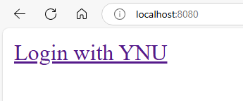
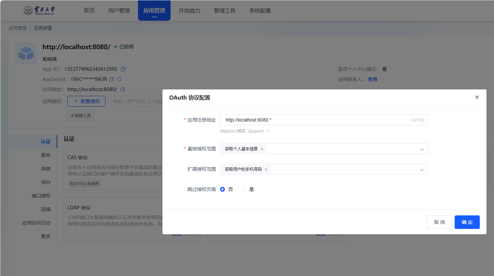

A very simple demo of OAuth 2.0 using Node.js，to add IDS login of YNU to your app and access minos API.



This demo is slightly modified from sohamkamani's [node-oauth-example](https://github.com/sohamkamani/node-oauth-example). More details in his [blog](https://www.sohamkamani.com/blog/javascript/2018-06-24-oauth-with-node-js/) (English) or my [blog](http://www.ruanyifeng.com/blog/2019/04/github-oauth.html) (Chinese).

## Step one: register the app

Register the app on minos : https://minos.ynu.edu.cn/ .



## Step two: get the code

First, clone the repo.

```bash
$ git clone git@github.com:liudonghua123/node-oauth-demo.git
$ cd node-oauth-demo
$ git checkout ynu
```

Second, modify the config.

- `.env`: replace the values of the `CLIENT_ID` and `CLIENT_SECRET` variables.
- `public/index.html`: replace the values of the `client_id` variable.

Third, install the dependencies.

```bash
$ npm install
```

## Step three: run the server

Now, run the server.

```bash
$ node index.js
```

Visit http://localhost:8080 in your browser, and click the link to login GitHub.

## Notices

- The access url of the new created app should be the same as the authorized url configured later. Or you will get 401 error when call get_access_token api.
- The access_token passed in profile api should be placed in the query or you will get 401 error.
